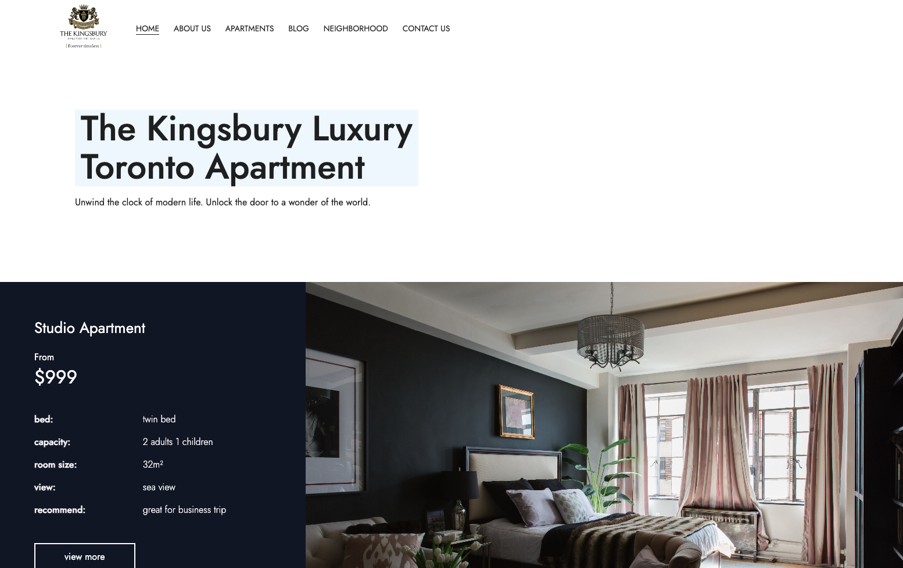

# Web Design Final Project
wnr20230627

[](https://github.com/lweligampolagedara/webdesign-project/actions/workflows/firebase-hosting-merge.yml)


Welcome to our Web Design Final Project! This document provides an overview of our project, pages, and instructions for setting it up and running.



[Link to the website](https://kingsbury-toronto-website.web.app)

## Project Overview

Our web design project focuses on creating a modern, mobile-first and user-friendly website for a luxurious apartment in Toronto. Our team consists of the following members:

- Lasitha Weligampola Gedara
- Srenezaa Parasharamatam
- Manushi Wijayagunawardana

## Pages

Our project includes the following pages:

1. **Home Page (home.html) by [Lasitha](mailto:l_weligampolagedara@fanshaweonline.ca):**
   The home page of "The Kingsbury Luxury Toronto Apartment" website. It features a stunning visual design with a focus on luxury and elegance. The page includes a prominent logo, a captivating heading, and a tagline. It showcases a studio apartment with its details and pricing. It also highlights key features of the apartments, such as stunning interior design and convenient location. The page uses a combination of images and text to engage visitors.

2. **About Us Page (about-us.html) by [Lasitha](mailto:l_weligampolagedara@fanshaweonline.ca):**
   The "About Us" page provides information about the hotel's philosophy and values. It describes the organization's focus on crafting immersive customer experiences. The page includes the hotel's logo and a description of its approach to design and customer satisfaction.

3. **Apartments Page (apartments.html) by [Manushi](mailto:M_wijayagunawardana@fanshaweonline.ca):**
   The "Apartments" page displays different types of apartments available for booking. It features a selection of studio apartments with images, pricing, bed configuration, room size, view, and recommendations. Each apartment has a "View More" link for additional details. The page is designed to showcase the variety of accommodation options and their amenities.

4. **Blog Page (blog.html)  by [Manushi](mailto:M_wijayagunawardana@fanshaweonline.ca):**
   The "Blog" page is the space where the hotel can share articles, updates, or insights related to luxury living, design, and travel. 

5. **Neighborhood/Explore Page (explore.html) by [Srenezaa](mailto:s_parasharamatam@fanshaweonline.ca):**
   The "Explore" or "Neighborhood" page is dedicated to showcasing the surrounding area and attractions near the hotel. It includes a heading introducing Toronto and its highlights. The content emphasizes the convenience of the hotel's location and provides reasons why visitors should choose this property for their stay. The page also features images and descriptions of downtown Toronto and its landmarks.

6. **Contact Us Page (contact.html) by [Srenezaa](mailto:s_parasharamatam@fanshaweonline.ca):**
   The "Contact Us" page features a contact form for users to submit inquiries. It requests the user's name, email, phone number, and message. A checkbox for consent is included, along with the hotel's address, phone numbers, and email. The form encourages users to engage with the hotel and provides various methods of contact.

**Design Principles:**

1. **Proximity:** Elements that are related are grouped together, like navigation links and their corresponding labels. For example, the navigation menu items are positioned close to the logo, making it clear they are part of the same navigation section.

2. **Contrast:** Text and images have appropriate contrast, making the content easy to read and understand. High contrast is used for text against its background, ensuring readability.

3. **Typography:** Consistent fonts and font sizes are used for headings and content. Font styles are chosen to match the luxurious and modern theme of the website.

4. **Whitespace:** Adequate whitespace is used to separate content elements, providing a clean and organized layout. The spacing around text and images prevents crowding and improves readability.

**Accessibility Compliance:**

The following strategies were used to improve accessibility compliance:

1. **Alternative Text:** Images include descriptive `alt` attributes, providing text alternatives for visually impaired users.

2. **Semantic HTML:** Semantic HTML elements like headings (`<h1>`, `<h2>`) are used properly to convey the document structure, making it easier for screen readers to interpret the content.

3. **Keyboard Navigation:** All interactive elements, such as navigation links and form fields, are accessible via keyboard navigation. The use of `<label>` elements is associated with form fields to improve form accessibility.

4. **Color Contrast:** High contrast between text and background is maintained to ensure readability, especially for users with low vision.

**Search Engine Optimization (SEO):**

The following SEO strategies were used:

1. **Page Titles:** Each page has a unique and descriptive title, indicating the page's content and relevance to user queries.

2. **Meta Descriptions:** Meta descriptions are used to provide concise and informative summaries of each page's content. This can entice users to click on search results.

3. **Meta Keywords:** While less impactful than in the past, some pages include relevant meta keywords that relate to the content of the page.

4. **URL Structure:** The URLs are clean and descriptive, incorporating relevant keywords where appropriate.

5. **Heading Structure:** Proper use of heading tags (`<h1>`, `<h2>`, etc.) creates a hierarchy that helps search engines understand the importance and context of the content.

6. **Image Optimization:** Images use descriptive filenames and alt text, which can contribute to image search optimization and accessibility.

7. **Internal Links:** The use of internal links helps users and search engines navigate between related content.

## Installation and Setup

Follow these steps to set up and run our web design project:

1. **Clone the Repository**: Clone this repository to your local machine using the following command:
   
   ```
   git clone https://github.com/lweligampolagedara/webdesign-project.git
   ```

2. **Navigate to Project Directory**: Use the terminal to navigate into the project directory:

   ```
   cd webdesign-project
   ```

3. **Open Index.html**: Open the `public/index.html` file in your preferred web browser to view the project.

## Contact Us

- Lasitha: l_weligampolagedara@fanshaweonline.ca
- Srenezaa: s_parasharamatam@fanshaweonline.ca
- Manushi: M_wijayagunawardana@fanshaweonline.ca

## References

- Colombo Hotels | The Kingsbury Hotel Colombo Official Site - https://www.thekingsburyhotel.com

- Canada: The Maple Leaf Trail - North America - Greatdays Group Travel - https://www.greatdays.co.uk/tour/maple-leaf-trail/

- Best Studio Apartment Decor Ideas to Maximize Space - Decorilla - https://www.decorilla.com/online-decorating/studio-apartment-decor/

- Condo Decorating Toronto | Condo Staging | Interior Decorating - https://www.hopedesigns.ca/interior-decorating/condo-decorating/

- Condo Interior Design: How to Find Condos with Picture Perfect Interiors - Melanie Jade Design - https://www.melaniejadedesign.com/condo-interior-design/

- 4 Small Studio Interior Designs That Give Little Places A Lift - https://www.home-designing.com/4-small-studio-interior-designs-that-give-little-places-a-lift

- What Exactly Is an Alcove Studio in NYC? | Hauseit® - https://www.hauseit.com/alcove-studio/

- 13 Loft Decor Ideas for Every Design Style - https://www.bhg.com/loft-decor-ideas-6752495
